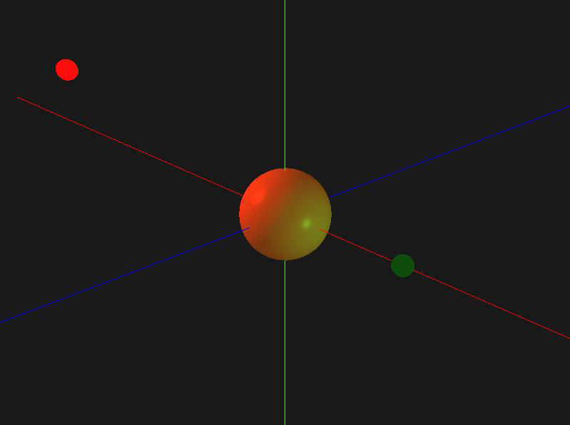

# Phong Lighting Shader – OpenGL (C++)

## Opis projektu

Ten projekt rozwija możliwości renderowania 3D w technologii OpenGL z użyciem języka C++, umożliwiając interaktywną manipulację kolorami oraz pozycjami źródeł światła w scenie.

### Kluczowe funkcje:

- **Manipulacja źródłami światła:**  
  Dynamiczna zmiana pozycji dwóch punktowych źródeł światła w osiach X, Y i Z, wpływająca bezpośrednio na efekty oświetlenia w scenie.

- **Interaktywna zmiana kolorów:**  
  Możliwość zmiany kolorów każdego źródła światła za pomocą dedykowanych klawiszy.

- **Wizualizacja 3D:**  
  Scena 3D zawierająca:
  - Osi współrzędnych dla lepszej orientacji przestrzennej,
  - Modele reprezentujące źródła światła,
  - Obiekt główny renderowany z użyciem modelu oświetlenia Phonga.

- **Sterowanie kamerą:**  
  - Swobodne obracanie widoku za pomocą myszki,  
  - Zoom (przybliżanie i oddalanie),
  - Płynne poruszanie się po scenie.

- **Transformacje geometryczne:**  
  Umożliwiające aktualizację pozycji świateł w czasie rzeczywistym.

Efektem działania programu jest realistyczna, dynamiczna scena 3D z pełną interakcją użytkownika z oświetleniem.

## Wymagania

- C++17 lub nowszy
- OpenGL
- GLFW
- GLAD
- GLM

## Sterowanie

| Klawisz / Akcja | Funkcja |
|-----------------|---------|
| W, A, S, D      | Poruszanie kamerą |
| Scroll Mouse    | Zoom (przybliżenie/oddalenie) |
| Mouse Move      | Obrót widoku |
| Klawisze 1,2,3  | Wybór źródła światła |
| Klawisze XYZ    | Przesuwanie źródeł światła |
| Klawisze RGB    | Zmiana kolorów świateł |

## Wizualizacje

